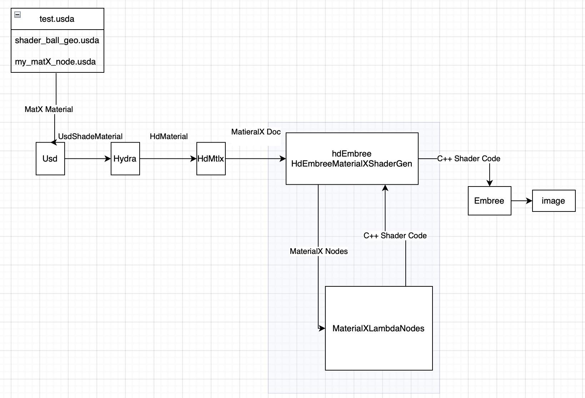

# MaterialXLambdaNodes

## Goal

To help contribute towards including MaterialX materials in a reference renderer

#### TODO: Add a real shaderball example here with a MatX material & usdrecord command targeting embree as a test

## Assumed Architecture

#### TODO: Is this very far off?

## Tasks

| Name    | Status |
| -------- | ------- |
| Build out a C++ library of nodes (one-to-one with glsl) | Not Started |
| Connect the node library with hdEmbree | Not Started     |
| Add tests    | Not Started    |

## Nodes

#### TODO: what's a reasonable set of nodes here? Are there categories of nodes to ignore? What's a best first node?

#### BSDF Nodes

| Name    | Status |
| -------- | ------- |
| todo | Not Started |

#### EDF Nodes

| Name    | Status |
| -------- | ------- |
| todo | Not Started |

#### VDF Nodes

| Name    | Status |
| -------- | ------- |
| todo | Not Started |

#### PBR Shader Nodes

| Name    | Status |
| -------- | ------- |
| todo | Not Started |

#### Utility Nodes

| Name    | Status |
| -------- | ------- |
| todo | Not Started |

### Standard Source Nodes

#### Texture Nodes

| Name    | Status |
| -------- | ------- |
| todo | Not Started |

#### Procedural Nodes

| Name    | Status |
| -------- | ------- |
| todo | Not Started |

#### Noise Nodes

| Name    | Status |
| -------- | ------- |
| todo | Not Started |

#### Shape Nodes

| Name    | Status |
| -------- | ------- |
| todo | Not Started |

#### Geometric Nodes

| Name    | Status |
| -------- | ------- |
| todo | Not Started |

#### Application Nodes

| Name    | Status |
| -------- | ------- |
| todo | Not Started |

### Standard Operator Nodes

#### Math Nodes

| Name    | Status |
| -------- | ------- |
| todo | Not Started |

#### Logical Operator Nodes

| Name    | Status |
| -------- | ------- |
| todo | Not Started |

#### Adjustment Nodes

| Name    | Status |
| -------- | ------- |
| todo | Not Started |

#### Compositing Nodes

| Name    | Status |
| -------- | ------- |
| todo | Not Started |

#### Conditional Nodes

| Name    | Status |
| -------- | ------- |
| todo | Not Started |

#### Channel Nodes

| Name    | Status |
| -------- | ------- |
| todo | Not Started |

#### Convolution Nodes

| Name    | Status |
| -------- | ------- |
| todo | Not Started |

### Reference Information

- [Original Thread](https://academysoftwarefdn.slack.com/archives/C02HJH53RN3/p1722833392119919)
- [MaterialX In Hydra and USD Architecture Guide](https://openusd.org/release/api/_page__material_x__in__hydra__u_s_d.html)
- [UsdMtlx](https://openusd.org/release/api/usd_mtlx_page_front.html)
- [HdEmbree](https://openusd.org/release/api/hd_embree_page_front.html)
- [HdMtlx](https://github.com/PixarAnimationStudios/OpenUSD/tree/release/pxr/imaging/hdMtlx)
- [hdSt](https://github.com/PixarAnimationStudios/OpenUSD/tree/release/pxr/imaging/hdSt)
    - shaders folder + material related files may be useful
- [hydra examples](https://github.com/PixarAnimationStudios/OpenUSD/tree/release/extras/imaging/examples)
- [MaterialX spec](https://github.com/AcademySoftwareFoundation/MaterialX/tree/main/documents/Specification)
